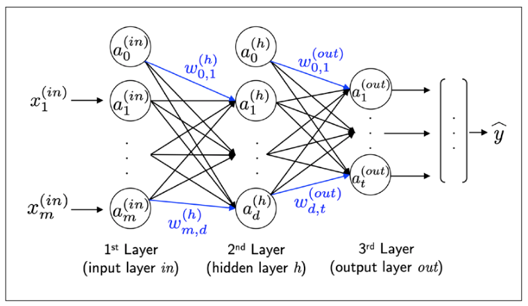

[`Métodos de Computación Flexible`](../README.md) > `2. Redes Neuronales Artificiales - Backprogation`

#  Unidad 2. Redes Neuronales Artificiales - Backpropagation

**Contenido.**

**Objetivo.**

En esta clase el alumno conocerá:

* La estructura básica del MLP.
* Las funciones de activación que pueden ser utilizadas en una neurona.
* El algoritmo Feedforward
* El algoritmo de Backpropagtion (online y batch)

## Introducción

Después de Madaline I, en 1971 se presentó la primera mejora significativa de las RNs feedforward. Werbos desarrollo el algoritmo de entrenamiento backpropagation, el cual fue publicada por primera vez en su tesis doctoral en 1974. La idea de la retropagación del error a través de sistemas no lineales existió siglos antes de que Werbos lo aplicara a las RNAs. Lamentablemente, el trabajo de Werbos paso desapercibido en la comunidad científica. Hasta que en 1982, Parker redescubrió la técnica y en 1985, publicó un reporte para el MIT.

Las RNs están compuestas de varias capas, y han tenido un papel principal en los algoritmos de aprendizaje profundo y sus arquitecturas. Ejemplos comunes son los productos desarrollados por Facebook, Microsoft, Amazon, Uber y Google que han invertido demasiado en investigaciones sobre NNs y Deep Learning.

Las Redes Neuronales Múlticapa (MLP, MulitiLayer Perceptron) representada en la imagen anterior tiene una capa de entrada, una capa oculta y una capa de salida. Las unidades en la capa oculta están completamente conectada a la capa de entrada y a la capa de salida. Si una red tiene más de una capa oculta es llamada Red Neuronal Artificial Profunda (Deep ANNs).

Mientras una unidad en la capa de salida puede ser suficiente para una tarea de clasificación binaria, es más común la forma de NN como la figura anterior, para realizar clasificación multiclase a través de la generalización de la técnica one-versus-all (OvA). La representación one-hot debe ser utilizada (como en variables categóricas).

### Redes Neuronales Múlticapa (M-L NNs)

Estas redes tienen un tipo especial de conexión entre capas llamado MLP.

## 1. Funciones de error

Función de costo: Error Cuadrático Medio (MSE, Mean Square Error).

$MSE_{NN} = \frac{1}{2} \Sigma_{i=0}^m (target_i - a_i^{(out))})^2$

Función de costo:

$J(w) = - \Sigma_{i=1}^n y^{[i]}\cdot log(a^{[i]}) + (1 -y^{[i]}) \cdot log(1-a^{[i]})$

## 2. Backpropagation

Tipos de entrenamientos:

* [`Ejemplo Online`](./code/brackpropagation_online.ipynb)
* [`Ejemplo Minibatch`](./code/MLP_batch_own.ipynb)
* [`Ejemplo Bach Keras`](./code/MLP_Keras.ipynb)

## 3. Algoritmos de retropagación modificados

### Regularización

EL término de regularización permite reducir el grado de overfitting, el término de regularización L2 es definido como (no regularizan las unidades bias):

$L2= \lambda||w||^2_2 = \lambda \Sigma_{j=1}^m w_j^2$

Mediante la agregación del término de regularización la función de costo logística se obtiene la siguiente ecuación:

$J(w) = - \Sigma_{i=1}^n y^{[i]} log(a^{[i]}) + (1 -y^{[i]})\, log(1-a^{[i]}) +  \lambda \Sigma_{j=1}^m wj^2$

### Implementación de scikit-learn

* [`Ejemplo MLP Scikit-Learn`](./code/mlp_sklrn_bcancer.ipynb)

[`Anterior`](../L02-1_perceptron/README.md) | [`Siguiente`](../README.md)
